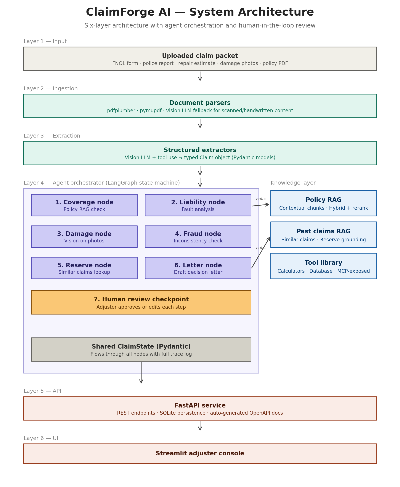
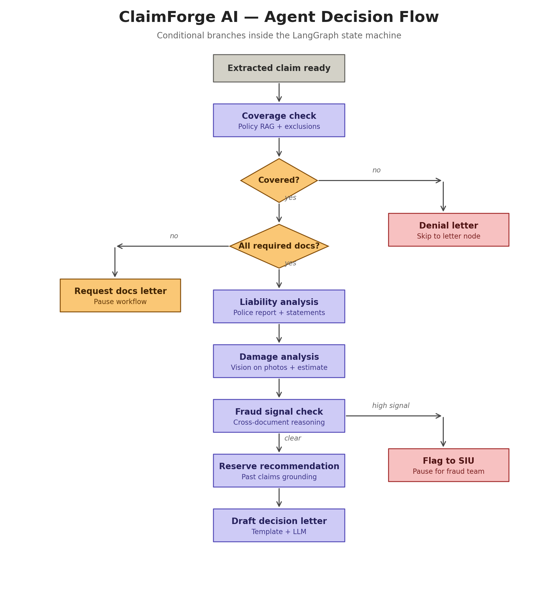

# ClaimForge AI — Architecture

This document describes the architecture of ClaimForge AI, an LLM-powered copilot for auto insurance claims adjusters. It explains the system's structure, the agent's decision flow, and the design choices behind both.

The architecture is intentionally split into two views:

1. **System architecture** — what the components are and how they fit together
2. **Agent decision flow** — how the agent reasons through a claim

Read them in that order.

---

## 1. System architecture

ClaimForge AI is a **layered system with an agentic core**. Six logical layers sit on top of each other, with a knowledge layer running alongside the agent. The flow is top-down: documents enter at the top, structured outputs and decisions emerge at the bottom.

### Layer 1 — Input

The starting point is a **claim packet**: a bundle of documents an adjuster would receive for a single auto claim. This typically includes the First Notice of Loss (FNOL) form, the police report, the repair estimate, photos of vehicle damage, and the relevant section of the policy document.

In a real deployment, these would arrive through a claims management system; in ClaimForge AI's prototype, the adjuster uploads them through the UI or drops them into a folder.

### Layer 2 — Ingestion

The **ingestion layer** takes raw uploaded files and produces a normalized internal representation. Its job is *not* to extract structured claim data — that comes in the next layer. Its job is to answer the question "what is in this file, and what does it look like?"

Three things happen here:

- **Classification** — every file is identified by type and tagged (`policy`, `fnol`, `police_report`, `estimate`, `photo`). Filenames are unreliable, so classification looks at file headers and content.
- **Parsing** — text PDFs go through `pdfplumber`/`pymupdf` for fast text and table extraction; scanned PDFs and form-heavy documents go through a vision LLM that handles layout, handwriting, and rotation in one shot.
- **Provenance preservation** — bounding boxes and page numbers are kept for every piece of text. This is what makes citations work later: when the agent says "this is excluded under section IV.B," the UI can highlight the actual passage on the page.

The output of ingestion is a list of `ParsedDocument` objects — clean, consistently shaped, ready for extraction or retrieval.

### Layer 3 — Extraction

The **extraction layer** converts parsed documents into a typed `Claim` object. This is where "raw text on page 3" becomes "claimant.date_of_birth = 1985-04-12."

Extraction uses vision LLMs with **structured output enforcement**: every extractor defines a Pydantic schema, the schema is passed as a tool definition to the LLM, and the LLM returns validated JSON. This eliminates the brittle "ask the model for JSON and pray it parses" pattern that breaks production systems.

Different document types use different extractors:

- The FNOL form extractor pulls claimant, vehicle, date of loss, and incident description
- The police report extractor pulls parties, contributing factors, citations, and officer's narrative
- The repair estimate extractor pulls line items, labor hours, and totals
- The photo extractor uses vision to identify damage areas, severity, and visible VIN/odometer

The output is a single `ExtractedClaim` Pydantic model — the contract that every downstream layer reads from.

### Layer 4 — Agent orchestrator

This is the brain of ClaimForge AI. It's implemented as a **LangGraph state machine**: nodes are processing steps, edges are conditional transitions, and a shared `ClaimState` object flows through the graph carrying data and a full trace log.

Six processing nodes plus a human-review checkpoint sit inside the orchestrator:

1. **Coverage node** — given the extracted claim and the policy, determines which coverages apply, whether exclusions bar coverage, and whether limits and deductibles are in play. Calls the Policy RAG tool.
2. **Liability node** — reads the police report and statements, assigns fault percentages, and explains the reasoning.
3. **Damage node** — uses vision on the damage photos and parses the repair estimate to determine repair feasibility versus total loss.
4. **Fraud node** — cross-references the FNOL narrative, the police report, the photos, and any prior claim history. Flags inconsistencies (e.g., damage doesn't match the described impact direction).
5. **Reserve node** — recommends an indemnity reserve and LAE (Loss Adjustment Expense) reserve. Calls the Past Claims RAG to ground the estimate in similar prior cases.
6. **Letter node** — drafts a coverage decision letter, denial letter, or request-for-documents letter depending on what came before.

The **human review checkpoint** is the safety valve. After each node produces an output, the UI surfaces it for the adjuster to approve, edit, or reject before the next node runs. This is what makes ClaimForge AI a *copilot*, not a black-box decision engine — and it's what makes the architecture acceptable for a regulated industry.

The **shared ClaimState** at the bottom of the orchestrator is the Pydantic model that every node reads from and writes to. It also carries a `trace` field — an ordered log of every node call, every LLM call, every tool call, with timing, tokens, and reasoning. This is what powers observability and the "show me the agent's work" view in the UI.

### Knowledge layer (right side)

Three retrieval/tool resources that agent nodes call into as tools:

- **Policy RAG** — a vector index of the policy document, built with **contextual retrieval** (each chunk is prefixed with a 1–2 sentence context blurb generated by an LLM, then embedded) plus **hybrid search** (BM25 + dense embeddings, fused with Reciprocal Rank Fusion) and a **reranker** on top. Returns policy passages with page and section citations.
- **Past Claims RAG** — a vector index of synthetic past claims with outcomes. The Reserve node queries this to find similar prior claims and use their settled amounts as a grounding signal.
- **Tool library** — deterministic Python functions: a deductible calculator, a database lookup for prior claims by VIN or claimant, a date-of-loss validator. These are also exposed via an **MCP (Model Context Protocol) server**, which means external clients like Claude Desktop can call ClaimForge AI's tools directly — a demonstration of the current standard for tool exposure in agent systems.

The agent calls these tools *as needed*, not on every step. Coverage queries hit Policy RAG; reserve decisions hit Past Claims RAG; nothing is called unnecessarily.

### Layer 5 — API

A thin **FastAPI service** sits between the agent and the UI. It exposes REST endpoints (`POST /claims`, `GET /claims/{id}/coverage_analysis`, `POST /claims/{id}/approve_step`) and handles persistence to SQLite. FastAPI was chosen because it's the industry standard for Python LLM apps, supports async (which matters when LLM calls are slow), and auto-generates OpenAPI documentation — so the API itself becomes part of the project's documentation.

### Layer 6 — UI

A **Streamlit application** that gives the adjuster a workbench: upload claim packets, review extracted data, inspect coverage analysis with citations, approve or edit each agent step, and download the final decision letter. Streamlit is the fastest path to a credible demo; if the project grows, the FastAPI backend is ready to support a Next.js frontend without changes.

### Cross-cutting concerns

Not drawn in the diagram to keep it readable, but present throughout:

- **Observability** — structured logging via `structlog`, plus LangSmith traces for every agent run. Every LLM call, token count, and cost is tracked.
- **Guardrails** — Microsoft Presidio for PII detection and redaction, Pydantic validators for output schema enforcement, refusal logic for out-of-scope questions.
- **Evaluation** — a golden set of hand-crafted claims with expected outputs at every stage. The eval harness scores extraction accuracy, retrieval recall, coverage decision accuracy, and letter quality (via LLM-as-judge), and produces a markdown report after every change.

---

## 2. Agent decision flow

The system architecture above shows *what exists*. This diagram shows *how the agent thinks* — the conditional branches that turn a chain of LLM calls into something that handles real-world variation.

Three things make this flow agentic rather than a simple pipeline:

1. **The agent makes decisions, not just transformations.** At each diamond, the agent inspects the current state and chooses where to go next.
2. **Early exits short-circuit work.** Not every claim needs to go through every step. A denied claim skips damage analysis; a claim missing documents pauses entirely.
3. **The state object accumulates context.** Each node's output is available to every subsequent node, which lets later nodes catch inconsistencies the earlier ones produced.

### Walking through the flow

**Start: extracted claim ready.** Once extraction is complete, the agent has a structured `ExtractedClaim` object and is ready to reason.

**Coverage check (purple).** The first real reasoning step. The agent loads the policy via Policy RAG and asks: does the policy cover this incident, and are there any exclusions that apply? The output is a structured `CoverageAnalysis` with a covered/not-covered decision and citations to the policy passages that support it.

**Decision: Covered? (amber diamond).** If the claim is not covered, the agent **skips the rest of the pipeline** and goes straight to drafting a denial letter (red box). There's no point analyzing damage or setting a reserve on a denied claim. This is the kind of decision logic that makes the agent useful — a naive chain would do all the work and then ignore most of it.

**Decision: All required docs present? (amber diamond).** Even on a covered claim, the agent checks whether it has what it needs. If the police report is missing, or there are no damage photos, the agent **pauses the workflow and drafts a "request documents" letter** (amber box). The claim stays in a `WAITING_FOR_DOCS` state until the adjuster uploads what's missing.

**Liability analysis (purple).** Reads the police report and any statements, identifies the parties, applies the fault rules for the state (comparative negligence by default), and produces a `LiabilityAnalysis` with fault percentages and a narrative explanation.

**Damage analysis (purple).** Uses vision on the photos to identify damaged areas, cross-references with the repair estimate's line items, and determines whether the vehicle is repairable or a likely total loss. Total loss thresholds vary by carrier; the agent uses a configurable rule (~70% of ACV by default).

**Fraud signal check (purple).** Now that the agent has the full picture — narrative, police report, photos, estimate, claim history — it looks for inconsistencies. Examples: damage shown in photos doesn't match the described impact; the claimant has three prior claims with similar patterns; the date of loss falls on a day before the policy was in force. Produces a list of `FraudSignal` objects with severity scores.

**Decision: clear or high signal?** If fraud signals exceed a configurable threshold, the agent **flags the claim to SIU (Special Investigations Unit)** (red box) and pauses for human review by a fraud specialist. Otherwise, the workflow continues.

**Reserve recommendation (purple).** Using all prior analysis plus retrieval of similar past claims, the agent recommends an initial reserve. It splits the recommendation into indemnity (the expected payout) and LAE (expected handling costs), and provides a reasoning trace showing which past claims informed the estimate.

**Draft decision letter (purple).** The final step. Using a template plus an LLM completion, the agent drafts the coverage decision letter — including the decision, the cited policy passages, the reserve recommendation, and any conditions. The adjuster reviews, edits, and approves.

### Why a state machine, not autonomous agents

There's a strong temptation in 2026 to use "autonomous multi-agent" frameworks where role-playing agents (a "Coverage Agent", a "Fraud Agent") talk to each other to figure out a claim. ClaimForge AI deliberately doesn't do this. Reasons:

- **Insurance is a regulated industry** where the same claim must produce the same decision given the same inputs. Autonomous agents are non-deterministic by design.
- **Adjusters need to inspect the agent's work.** A state machine with explicit nodes is auditable; an autonomous swarm is not.
- **Real claims systems are state machines** — they always have been, long before LLMs. Modeling the agent the same way means the architecture matches how the industry already thinks.

This is the "bounded autonomy" pattern: each node has freedom to reason and call tools within its scope, but the overall flow is deterministic and inspectable. It's the consensus answer among serious teams building production agent systems, and it's what makes ClaimForge AI feel like a real product rather than a demo.

---

## 3. Key design decisions (and why)

A short reference of the choices that most shaped the architecture:

- **LangGraph over CrewAI/AutoGen** — state machines beat autonomous swarms for regulated workflows.
- **Pydantic everywhere** — typed contracts between layers prevent the most common production bug: an LLM returns slightly different JSON and downstream code crashes.
- **Vision LLM as the primary parser** for scanned documents instead of OCR + cleanup — fewer tools, better output on handwriting and complex layouts.
- **Contextual retrieval + hybrid search + reranker** for Policy RAG — current best practice; measurable accuracy improvements over naive chunking.
- **MCP-exposed tools** — lets ClaimForge AI's capabilities be called by any MCP client, demonstrating the modern standard for tool exposure.
- **Human-in-the-loop at every node** — required for industry acceptance, and a more honest demo than fully autonomous claim handling.
- **Evaluation harness from day one** — accuracy metrics on extraction, retrieval, and decisions; the single biggest differentiator between a portfolio project and a serious one.

---

## 4. What this architecture buys you

When someone walks through this document, here's what they should take away:

- ClaimForge AI is **layered** — concerns are separated, layers can be swapped out, and the boundaries are typed.
- The agent has **explicit state and explicit transitions** — nothing happens by magic.
- **Citations and provenance** flow end to end — from the bounding box on page 3 of a PDF to the highlighted passage in the UI.
- **Modern techniques are used where they matter** — contextual retrieval, structured outputs, vision-first ingestion, MCP — without buzzword-driven design.
- **Evaluation is built in**, not retrofitted — every change is measured against a golden set.

That's the architecture. The next document in `docs/` will walk through the data model (the Pydantic schemas that tie it all together) and the build plan.
